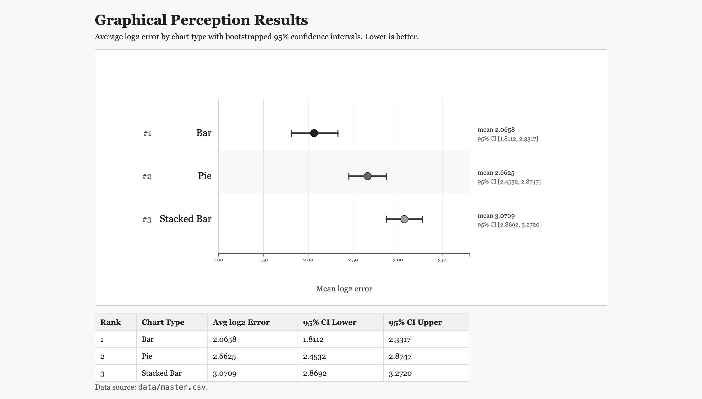

Assignment 3 – Replicating a Classic Experiment
===

**Live experiment:** [https://sctrautz.github.io/a3-experiment/](https://sctrautz.github.io/a3-experiment/)

---

## Description

This project replicates the Cleveland & McGill (1984) graphical perception experiment. Participants are shown a series of randomly generated charts with **two elements marked by a dot (●)** and are asked:

> "What percentage is the smaller marked value of the larger marked value?"

Three chart types (conditions) are tested:

| Condition | Hypothesis |
|-----------|-----------|
| **Bar Chart** | Best accuracy - judging aligned lengths is easiest (Cleveland & McGill's top-ranked elementary task) |
| **Pie Chart** | Intermediate accuracy - angle/area is harder than length, but easier than no-baseline comparisons. |
| **Stacked Bar Chart** | Worst accuracy - length without a common baseline is hardest. |

Each participant completes **60 trials** (20 per chart type) in randomized order. The study was conducted by distributing the link to participants and allowing them to complete the tasks. The completed results were then saved and compiled into a master CSV file for analysis. 

### Experiment Screenshots

**Bar Chart Trial:**


**Pie Chart Trial:**


**Stacked Bar Chart Trial:**


*(Screenshots taken from a live session — two elements marked with ● dots.)*

---

## Results

Using `data/master.csv` (10 participants, 600 total trials, 200 per chart type), average log₂ error by condition ordered best → worst:

| Rank | Chart Type | Avg log₂ Error | 95% CI Lower | 95% CI Upper |
|------|-----------|---------------|-------------|-------------|
| 1 | Bar | 2.0658 | 1.8074 | 2.3282 |
| 2 | Pie | 2.6625 | 2.4516 | 2.8719 |
| 3 | Stacked Bar | 3.0709 | 2.8713 | 3.2709 |

*(95% CIs computed via percentile bootstrap over trial errors - 20,000 resamples)*

**D3 Results View (computed + rendered with D3):** [results.html](results.html)



---

## Error Calculation

Error is calculated using the Cleveland & McGill log-base-2 formula:

```
Error = log₂(|reportedPercent − truePercent| + 1/8)
```

- **True percent** = `round(min(v₁, v₂) / max(v₁, v₂) × 100)` where v₁, v₂ are the two marked values
- **Special case:** when `|reported − true| = 0`, error = 0 (avoids `log₂(1/8) = −3`)
- Whole-number percentages are used throughout

---

## Data Collection Instructions

1. Open the experiment in a browser (local or via gh-pages).
2. Enter a unique Participant ID.
3. Complete all 60 trials.
4. At the end, copy the CSV output and append it to `data/master.csv`.
5. Repeat for each participant.

CSV columns: `participant, trial, chartType, truePercent, reportedPercent, error`

---

## Technical Achievements

- **D3 visualizations** - all three chart types (bar, pie, stacked bar) rendered entirely with D3 from scratch with no chart library.
- **Fully randomized experiment** - trial order is shuffled; data points are randomly generated each trial (5–10 points, values 10–100).
- **Cleveland & McGill error metric** - implemented exactly as described in the original paper, including the special-case handling.
- **Single-page experiment flow** - start → instructions → trials → CSV export, all in one HTML file with no server required.
- **Keyboard support** - Enter key advances trials for faster data collection and ease of use.

## Design Achievements

- **Cleveland & McGill visual style** - bar charts use unfilled bars (outline only) with solid dots above marked bars, closely matching the original paper's figure style.
- **Neutral grayscale throughout** - pie and stacked bar charts use alternating grayscale fills (no color) to keep slices/segments visually distinguishable without biasing the perceptual task.
- **Marker visibility** - markers on dark segments use white fill with black stroke; markers on bar charts use solid black, ensuring visibility against all backgrounds without using color.
- **Minimal, clean UI** - Georgia serif font, no distracting elements during trials, progress counter shown clearly.

---

## References

- Cleveland, W. S., & McGill, R. (1984). Graphical perception: Theory, experimentation, and application to the development of graphical methods. *Journal of the American Statistical Association, 79*(387), 531–554. http://www.cs.ubc.ca/~tmm/courses/cpsc533c-04-spr/readings/cleveland.pdf
- Heer, J., & Bostock, M. (2010). Crowdsourcing graphical perception: Using Mechanical Turk to assess visualization design. *CHI 2010*. https://idl.cs.washington.edu/files/2010-MTurk-CHI.pdf
- D3.js documentation: https://d3js.org/
- Wikipedia – Bootstrapped confidence intervals: http://en.wikipedia.org/wiki/Confidence_interval#Meaning_and_interpretation
